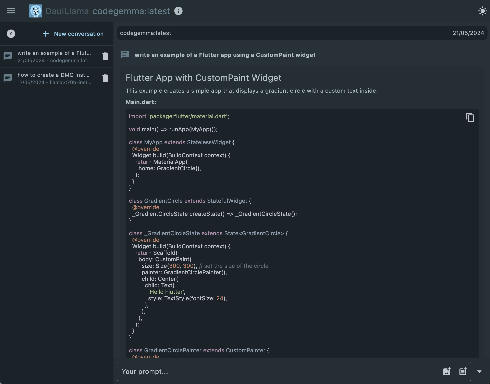
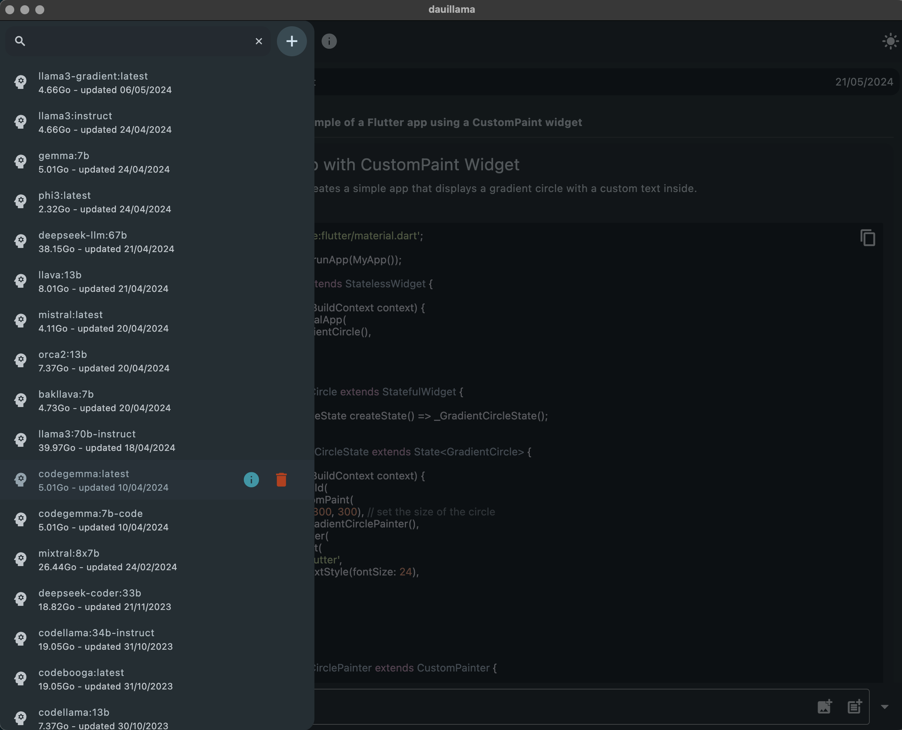
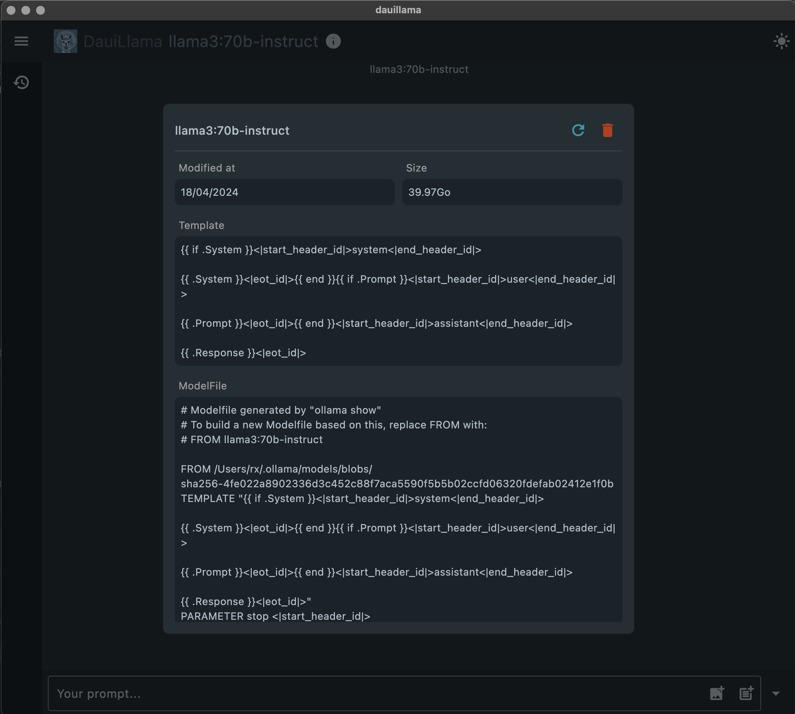
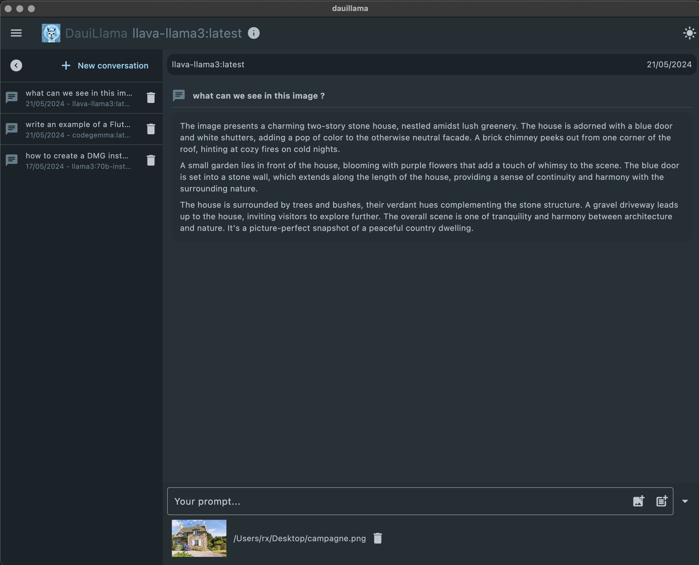
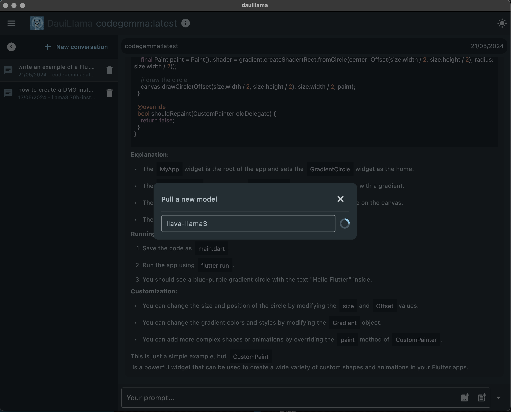
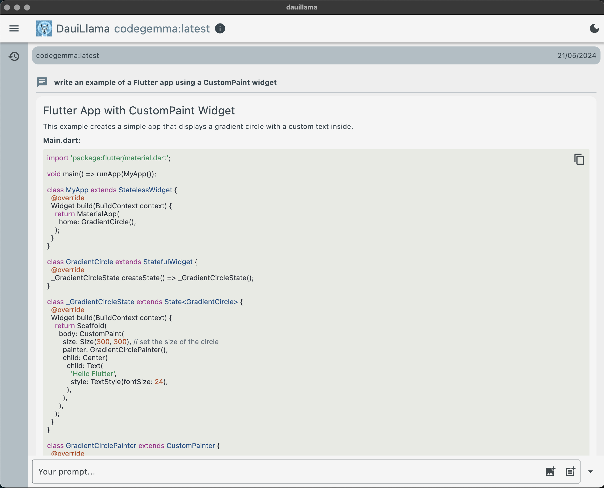

# Blue Djinn

A Dart(Flutter) tool for software development focused on using local LLMs via [Ollama](https://ollama.com) API. This started as a fork of [dauillamma](https://github.com/rxlabz/dauillama).

- uses [Ollama Dart](https://pub.dev/packages/ollama_dart)

## Usage

Launch Ollama desktop app or run [ollama serve](https://github.com/ollama/ollama#start-ollama).

The [OllamaClient](https://pub.dev/documentation/ollama_dart/latest/ollama_dart/OllamaClient-class.html) attempts to retrieve the `OLLAMA_BASE_URL` from the environment variables, defaulting to http://127.0.0.1:11434/api if it is not set.

## Platforms
- [x] Macos
- [ ] Windows
- [x] Linux
- [ ] Web

## Features

- [x] generate a chat completion
- [x] list models
- [x] show model information
- [x] pull a model
- [x] update a model  
- [x] delete a model
- [x] Chat history
- [ ] temperature & model options 
- [ ] create a model (modelFile)
- [ ] prompt templates library
- [ ] ollama settings customization

## Screenshots

___

___

___

___

---

